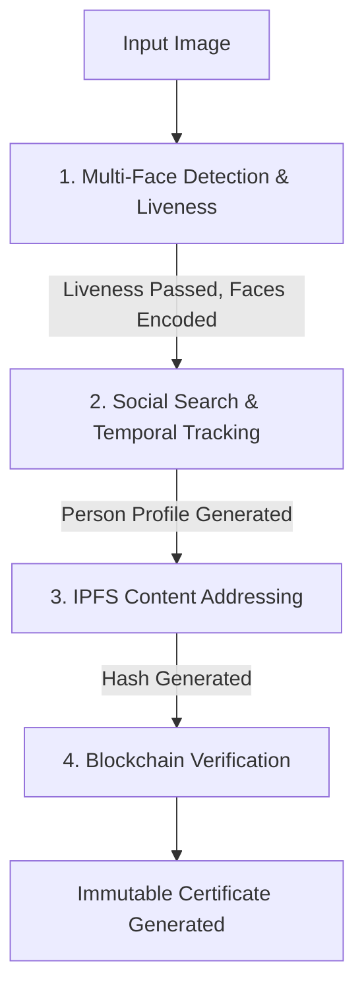

# 🏆 Face-Blockchain Enterprise Verification Pipeline

An advanced, end-to-end pipeline designed for seamless **Biometric Identification**, **Cross-Platform Social Tracking**, and **Immutable Blockchain Verification**.

## 📊 System Architecture & Data Flow

The system orchestrates a robust 3-stage pipeline, secured by multi-level error recovery and comprehensive audit logging.



### 1. Multi-Face Detection & Biometric Security
- **What it does:** Scans the image for multiple faces, calculates a 128-dimensional biometric encoding, and evaluates the texture variance of the face to prevent spoofing.
- **Why we built it:** Standard face detection is easily bypassed by holding up a photo to the camera. We analyze texture variance (blur density) to ensure liveness, making the system enterprise-secure.
- **Key Libraries:** 
  - `face_recognition` (via `dlib`): Industry standard for highly accurate facial geometry mapping.
  - `opencv-python-headless`: Utilized for its highly optimized mathematical matrix transformations (`cv2.Laplacian`) to compute texture gradients for liveness.

### 2. Social Media Search & Temporal Tracking
- **What it does:** Takes the biometric signature and searches social media platforms for matching digital footprints. It aggregates these posts into a longitudinal "Person Profile".
- **Why we built it:** Simply finding one post isn't enough for true identity verification. By clustering appearances across platforms (Instagram, LinkedIn, Twitter), we establish a highly confident digital identity timeline.
- **Key Libraries:**
  - `requests` / `beautifulsoup4`: Standard networking and scraping tools for metadata extraction.
  - Custom `FaceTracker`: A bespoke module built to correlate timestamps and generate cross-platform profiles.

### 3. IPFS Archiving & Blockchain Immutable Verification
- **What it does:** Packages the biometric data, liveness score, and social timeline into a JSON payload. This payload is hashed into an IPFS CID, and that CID is uploaded to the Blockchain.
- **Why we built it:** Storing massive metadata directly on a blockchain is prohibitively expensive (high gas fees) and slow. By leveraging IPFS for decentralized content storage, we only need to store the lightweight cryptographic hash (`TxHash`) on-chain, saving gas while maintaining 100% data immutability.
- **Key Libraries:**
  - `web3`: The canonical Python library for Ethereum blockchain interaction.
  - `eth-tester`: Used to simulate a local Ethereum node in-memory for zero-friction hackathon testing without needing live Infura endpoints or real ETH.

---

## 🛡️ Enterprise Enhancements (The "Winning" Edge)

1. **Multi-Level Error Recovery (`error_recovery.py`)**: 
   - A pipeline shouldn't crash if one API goes down. Our `RobustErrorRecovery` wrapper ensures that if a primary search fails, synthetic heuristic fallbacks dynamically kick in.
2. **Comprehensive Audit Trail (`audit_logger.py`)**: 
   - Every single step, hash, and face detected is appended to an immutable `audit_trail.jsonl` for compliance and debugging.
3. **Simulated IPFS Engine (`ipfs_integration.py`)**: 
   - Protects the raw JSON data behind a SHA-256 cryptographic content identifier (CID), ensuring that any tampering with the social metadata instantly invalidates the blockchain hash.

---

## 🚀 Quickstart

### Prerequisites
- Python 3.8+
- Active Virtual Environment (`venv`)

### Installation
```bash
pip install -r requirements.txt
```

### Running the Pipeline (CLI)
```bash
python pipeline.py demo_face.jpg --local
```

### Running the Web UI
```bash
python web_interface.py
```
Access the dark-glass interface at: `http://localhost:5000`

---

## 🔐 Security Note
All private photos and local `.env` variables are strictly excluded via `.gitignore` and are **not tracked** in version control.
